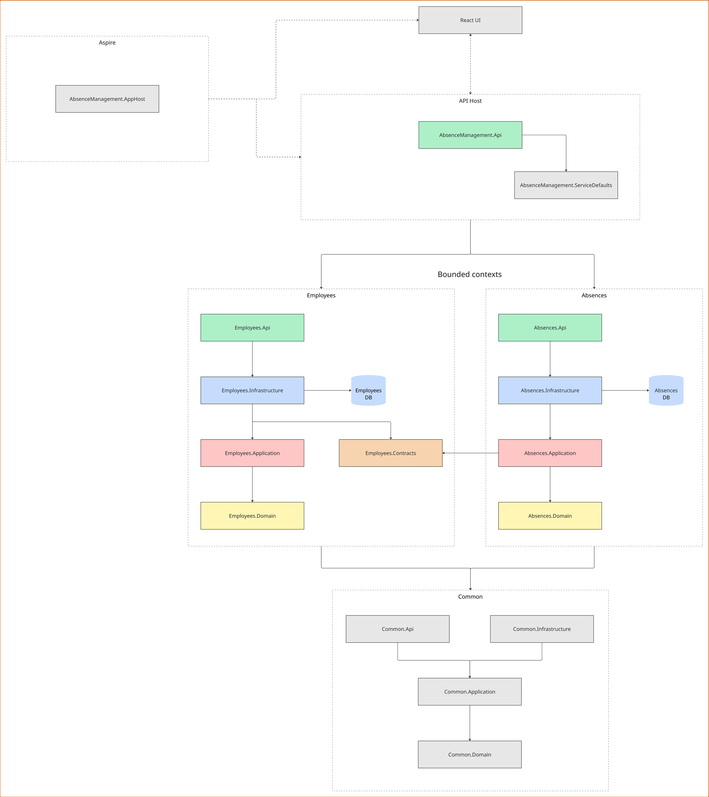

# Absence Management

A web application to create and manage absences of employees.

Employees file absence requests, approvers decide them. The backend is a modular monolith in .NET
with a DDD-oriented layering per bounded context using Clean Architecture. The frontend is an Nx
workspace with two React applications, `web` for employees and `admin` for approvers. .NET Aspire
starts everything: database, API and both dev servers.

| Part      | Stack                                                                    |
| --------- | ------------------------------------------------------------------------ |
| Backend   | .NET 10, ASP.NET Core Minimal APIs, EF Core, PostgreSQL                  |
| Frontend  | React 19, Vite 8, Mantine, TanStack Query, TypeScript                    |
| Local run | .NET Aspire (PostgreSQL in a container, dashboard with logs and traces)  |

## Layout

```text
src/                the backend
src/Common/         building blocks every bounded context reuses
src/Contexts/       one folder per bounded context, four projects each
src/Hosts/          the web host that mounts the bounded contexts
tests/              tests for the backend
tests/Contexts/     one test project per bounded context
tests/Architecture/ rules that hold across all contexts, checked with ArchUnitNET
aspire/             the AppHost: which resources run and how they depend on each other
frontend/           the frontend built as Nx workspace, apps and packages
```

## Getting started

Prerequisites: the [.NET 10 SDK](https://dotnet.microsoft.com/download/dotnet/10.0), a container
runtime (Docker Desktop or Podman), and Node 22.12 or newer with pnpm enabled via
`corepack enable`.

```bash
dotnet run --project aspire/AbsenceManagement.AppHost
```

Aspire takes care of the rest: it starts the PostgreSQL container, hands each bounded context its
connection string, runs `pnpm install`, regenerates the API client, and only then brings up the
two dev servers.

The Aspire dashboard opens at <http://localhost:15246> and lists every resource with its URL: the
API (interactive docs under `/scalar/v1`), the two frontends, PostgreSQL and pgAdmin. The ports of
the applications are assigned per run, so look them up in the dashboard.

With the optional Aspire CLI (`dotnet tool install --global Aspire.Cli`) the same thing works from
anywhere in the repository:

```bash
aspire run
```

## Tests and checks

```bash
dotnet test
```

```bash
cd frontend && pnpm test && pnpm check
```

`pnpm check` runs type checking, oxlint, the architecture boundary check, and the formatting check.

## Business rules

- A request needs an employee, an absence type and a valid date range, and starts as `Open`.
- Requests for the same employee may not overlap.
- Only open requests may be edited, approved or rejected. A decision is final.

## Known limitations

- There is no authentication or authorization. The employee and admin apps represent the two roles.
- Public holidays, partial days, notifications and multi-stage approvals are not supported.
- Concurrent updates are not protected by optimistic concurrency control.

## Documentation

- [docs/COMMANDS.md](docs/COMMANDS.md) — the cheat sheet: useful commands that come up while
  working on this repository
- [docs/TASK.md](docs/TASK.md) — the original task description
- [docs/BOOTSTRAP.md](docs/BOOTSTRAP.md) — how this repository was built, step by step, and why
- [AGENTS.md](AGENTS.md) — rules, instructions, and context provided for coding agents (and
  humans) for interacting with the codebase of this repository.

## Architectural overview

The Aspire AppHost (orchestrator) starts the API web host, which mounts one bounded context per
domain boundary, and the React applications talk to the API over HTTP. Inside a bounded context the
dependencies point inwards, from `Api` over `Infrastructure` and `Application` to `Domain`, and
every one of them owns its database. They never reference each other directly: `Absences` depends
on the `Contracts` project of `Employees`. `Common` holds the building blocks all of them reuse.


