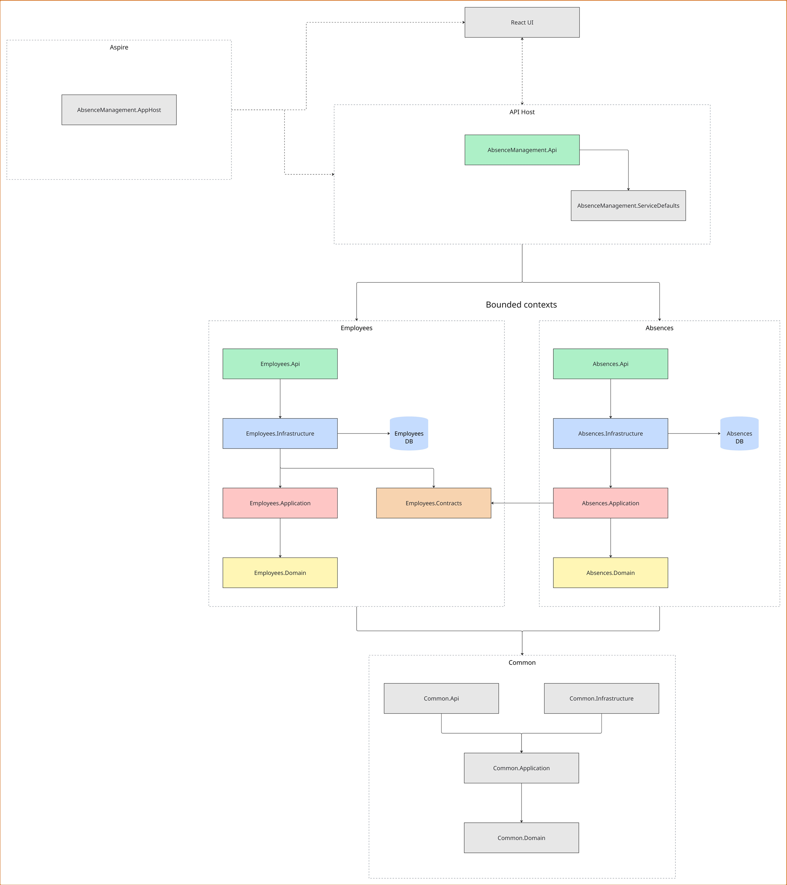

# Absence Management

A web application to create and manage absences of employees.

Employees file absence requests, approvers decide them. The backend is a modular monolith in .NET
with a DDD-oriented layering per bounded context using Clean Architecture. The frontend is an Nx
workspace with two React applications, `web` for employees and `admin` for approvers. .NET Aspire
starts everything: database, API and both dev servers.

| Part      | Stack                                                                    |
| --------- | ------------------------------------------------------------------------ |
| Backend   | .NET 10, ASP.NET Core Minimal APIs, EF Core, PostgreSQL                  |
| Frontend  | React 19, Vite 8, TypeScript 7, Mantine, TanStack Query                  |
| Local run | .NET Aspire (PostgreSQL in a container, dashboard with logs and traces)  |
| Toolchain | mise (installs the SDK, Node and pnpm from the versions the repo pins)   |

## Layout

```text
src/                the backend
src/Common/         building blocks every bounded context reuses
src/Contexts/       one folder per bounded context, four projects each
src/Hosts/          the web host that mounts the bounded contexts
tests/              tests for the backend
tests/Contexts/     one test project per bounded context
tests/Architecture/ rules that hold across all contexts, checked with ArchUnitNET
aspire/             the AppHost: which resources run and how they depend on each other
frontend/           the frontend built as Nx workspace, apps and packages
```

## Getting started

Two prerequisites: [mise](https://mise.jdx.dev) and a container runtime (Docker Desktop or Podman).
mise reads the versions this repository already pins (see [Tool versions](#tool-versions)), installs
them, and puts them on the `PATH` of this directory. So the SDK does not have to be installed by
hand and no other project's toolchain is disturbed.

**1. Install mise** — one command per operating system:

```bash
# Windows (Scoop, see docs/COMMANDS.md if Scoop is not installed yet)
scoop install mise

# macOS
brew install mise

# Linux
curl -fsSL https://mise.run | sh
```

**2. Activate it in the shell**, so entering the repository switches the versions. Add the line to
the shell profile and open a new shell:

```bash
# PowerShell, in $PROFILE
(&mise activate pwsh) | Out-String | Invoke-Expression

# zsh, in ~/.zshrc
eval "$(mise activate zsh)"

# bash, in ~/.bashrc
eval "$(mise activate bash)"
```

**3. Install the tools**, from the repository root:

```bash
mise trust && mise install
```

`mise trust` confirms this repository's `mise.toml` once, `mise install` downloads the .NET SDK,
Node and pnpm. `dotnet --version`, `node --version` and `pnpm --version` then report the pinned
versions.

**4. Run the application:**

```bash
dotnet run --project aspire/AbsenceManagement.AppHost
```

Aspire takes care of the rest: it starts the PostgreSQL container, hands each bounded context its
connection string, runs `pnpm install`, regenerates the API client, and only then brings up the
two dev servers.

The Aspire dashboard opens at <http://localhost:15246> and lists every resource with its URL: the
API (interactive docs under `/scalar/v1`), the two frontends, PostgreSQL and pgAdmin. The ports of
the applications are assigned per run, so look them up in the dashboard.

With the optional Aspire CLI (`dotnet tool install --global Aspire.Cli`) the same thing works from
anywhere in the repository:

```bash
aspire run
```

## Tool versions

mise installs all three toolchains, but it does not become a second place to write a version down.
Each version stays in the file its own ecosystem already reads, and mise reads that file:

| Tool     | Declared in                                   | How mise gets it                    |
| -------- | --------------------------------------------- | ----------------------------------- |
| .NET SDK | `global.json` — `sdk.version`                 | Reads it (`idiomatic_version_file`) |
| Node     | [mise.toml](mise.toml) — `node`               | Declared there directly             |
| pnpm     | `frontend/package.json` — `packageManager`    | `corepack enable` activates it      |

So there is exactly one place per tool. `global.json` is what the `dotnet` CLI, Rider and MSBuild
already read, and `packageManager` is what Corepack and pnpm itself read. Adding either version
to `mise.toml` as well would create a pair that can drift.

Node is the exception, and deliberately: `engines.node` in `frontend/package.json` states the range
consumers need, not the version this repository is built with, so mise ignores it and `mise.toml`
names the real one.

`mise.lock` records the exact versions those requests resolved to. It and `mise.toml` drive local
machines and [CI](.github/workflows/ci.yml) alike, so a version can only be raised in one place.

JetBrains IDEs pick the versions up through the
[Mise plugin](https://plugins.jetbrains.com/plugin/24904-mise), see
[docs/COMMANDS.md](docs/COMMANDS.md#jetbrains-ides).

## Tests and checks

```bash
dotnet test
```

```bash
cd frontend && pnpm test && pnpm check
```

`pnpm check` runs type checking, oxlint (including Nx's architecture boundary rule), and the
formatting check.

## Business rules

- A request needs an employee, an absence type and a valid date range, and starts as `Open`.
- Requests for the same employee may not overlap.
- Only open requests may be edited, approved or rejected. A decision is final.

## Known limitations

- There is no authentication or authorization. The employee and admin apps represent the two roles.
- Public holidays, partial days, notifications and multi-stage approvals are not supported.
- Concurrent updates are not protected by optimistic concurrency control.

## Documentation

- [docs/COMMANDS.md](docs/COMMANDS.md) — the cheat sheet: useful commands that come up while
  working on this repository
- [docs/TASK.md](docs/TASK.md) — the original task description
- [docs/BOOTSTRAP.md](docs/BOOTSTRAP.md) — how this repository was built, step by step, and why
- [AGENTS.md](AGENTS.md) — rules, instructions, and context provided for coding agents (and
  humans) for interacting with the codebase of this repository.

## Architectural overview

The Aspire AppHost (orchestrator) starts the API web host, which mounts one bounded context per
domain boundary, and the React applications talk to the API over HTTP. Inside a bounded context the
dependencies point inwards, from `Api` over `Infrastructure` and `Application` to `Domain`, and
every one of them owns its database. They never reference each other directly: `Absences` depends
on the `Contracts` project of `Employees`. `Common` holds the building blocks all of them reuse.


